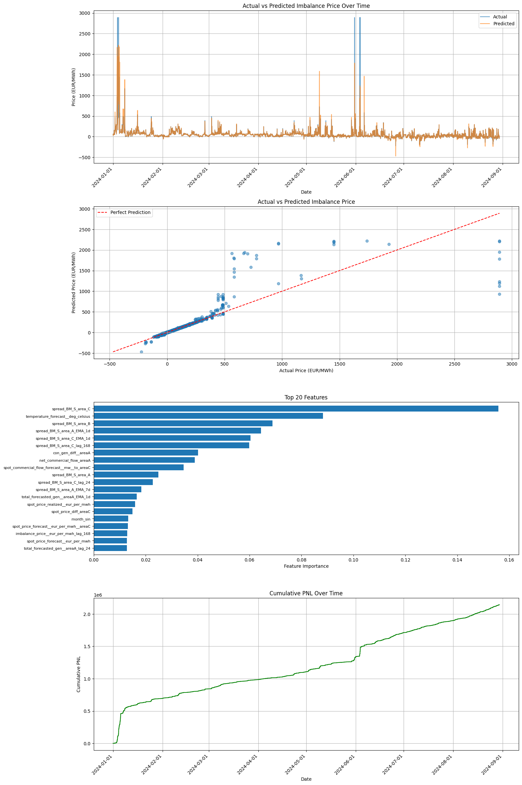

# Energy Market Prediction Model

## Project Description

A machine learning-based forecasting system for day-ahead energy market prices using XGBoost regression. The model predicts energy prices to support trading decisions, optimizing profit and loss (PNL) through intelligent price spread forecasting. Predictions are made at 9:30am each day for the following trading window (00:00 to 23:59 of the next day).

**Key Features:**
- STL-based data preprocessing and missing value imputation
- Advanced feature engineering (time-based features, moving averages, lagged values)
- XGBoost regression optimized for trading PNL with Optuna hyperparameter tuning
- Backtesting framework for trading strategy evaluation
- Command-line and Jupyter notebook support

## Setup

1. Install dependencies: `uv pip install -r requirements.txt`
2. Run the model: `python3 main.py --n_trials 30` (or explore via `/jupyter` notebooks)
3. Results are saved to `/output` directory

## Methodology

**Data Preparation:**
- Missing data imputation using STL decomposition with linear interpolation
- Outlier detection and handling
- Data quality checks (duplicates, formatting, irregular intervals)

**Feature Engineering:**
- Time-based: seasonal indicators, cyclical encoding (hour/weekday/month), weekend flags
- Energy-related: generation forecasts, renewable share, price spreads, load differences
- Technical: Moving averages (SMA/EMA) with 1-day and 7-day windows, lagged values (24h, 48h, 168h)

**Model:**
- XGBoost regression with Optuna optimization minimizing negative PNL
- Train/validation/test split for robust evaluation
- Metrics: MSE, RMSE, MAE, MAPE

## Results

**Best Performance (Trial 8 of 30):**
- **Total PNL:** €1,384,880.61
- **Key Parameters:** n_estimators=498, learning_rate=0.076, max_depth=5

The optimization explored PNL ranging from €973,797 to €1,384,880. Feature importance analysis shows lagged values and moving averages as top predictors.

*Visualization shows: (1) Actual vs Predicted prices, (2) Prediction accuracy, (3) Top 20 features, (4) Cumulative PNL progression.*
