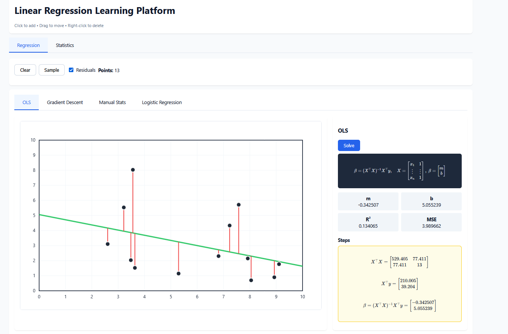

# Machine Learning & Statistics Learning Platform

An interactive web application for learning machine learning algorithms and statistical methods through visualization. Click to add data, see algorithms work step-by-step, and build intuition through real-time feedback.



## Features

**Regression**: OLS, Gradient Descent with loss visualization, Manual calculations (TSS/ESS/RSS), Logistic Regression with classification metrics

**Statistics**: Pearson Correlation, Two-sample t-Test, One-way ANOVA with distribution visualizations

## Setup

```bash
pip install -r requirements.txt
python src/app.py
```

Visit http://127.0.0.1:5000

## Usage

**Regression tabs**: Click to add points, drag to move, right-click to delete. Use "Solve" to fit model. Gradient Descent shows step-by-step optimization.

**Logistic Regression**: Select group, add points, click "Initialize" then "Auto" to train. Adjust threshold or use Youden's index for optimal cutoff.

**Statistics tabs**: Add data points by clicking canvas regions. View detailed calculations, test statistics, and distribution plots.

## Architecture

- **Backend**: Flask 3.0.0 serving static files
- **Frontend**: Vanilla JavaScript (utils.js, solvers.js, app.js), KaTeX for formulas, Canvas API for rendering

